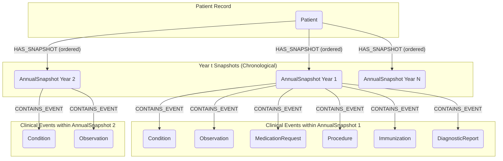

# EHR Graph Representation for Temporal GNN and Diffusion Model

This document outlines the graph structure, node properties, and FHIR resource mappings for representing patient EHR data. The goal is to create a graph suitable for a temporal Graph Neural Network (GNN) architecture that feeds into a diffusion model for predicting future yearly health snapshots.

## I. Graph Structure Visual



## II. Node Types and Their Model Features (Vectorized)

This section focuses on properties that will be vectorized and fed into the model. FHIR paths indicate where to find the source data. "Vectorization" describes how the data is transformed into a numerical format for the model.

---

### 1. `Patient` Node

* **Purpose**: Central node representing an individual patient.
* **FHIR Source Resource**: `Patient`
* **Model Features**:
    * **`gender_vector`**:
        * *FHIR Path*: `Patient.gender` (e.g., "male", "female", "other").
        * *Vectorization*: One-Hot Encoded or learnable Embedding.
    * **`race_vector`**:
        * *FHIR Path*: `Patient.extension` where `url` is `"http://hl7.org/fhir/us/core/StructureDefinition/us-core-race"`, then from the nested `valueCoding.code` (OMB race category codes).
        * *Vectorization*: One-Hot Encoded or learnable Embedding.
    * **`ethnicity_vector`**:
        * *FHIR Path*: `Patient.extension` where `url` is `"http://hl7.org/fhir/us/core/StructureDefinition/us-core-ethnicity"`, then from the nested `valueCoding.code` (OMB ethnicity category codes).
        * *Vectorization*: One-Hot Encoded or learnable Embedding.
    * *(Note: `Patient.birthDate` is used to derive `age_at_snapshot` on the `AnnualSnapshot` node and is not a direct feature of the `Patient` node in the GNN input).*

---

### 2. `AnnualSnapshot` Node

* **Purpose**: Represents the summarized health state and all relevant clinical information for a patient within a specific calendar year. This is the unit of prediction for the diffusion model.
* **FHIR Source Resource**: This is a conceptual node derived by aggregating `ClinicalEventNode`s based on their `event_timestamp` falling within a calendar year.
* **Model Features**:
    * **`year_vector`**:
        * *Derivation*: The calendar year this snapshot represents.
        * *Vectorization*: Normalized numerical value (e.g., `(year - mean_year) / std_year`) or a learnable Embedding.
    * **`age_at_snapshot_vector`**:
        * *Derivation*: Patient's age during this specific year (calculated from `Patient.birthDate` and the snapshot's `year`).
        * *Vectorization*: Normalized numerical scalar (e.g., `age / 100`).

---

### 3. `Condition` Node

* **Purpose**: Represents a diagnosed health condition relevant during the snapshot year.
* **FHIR Source Resource**: `Condition`
* **Model Features**:
    * **`snomed_embedding`**:
        * *FHIR Path*: `Condition.code.coding.code` where `system` is SNOMED CT (e.g., `"http://snomed.info/sct"`).
        * *Vectorization*: Dense embedding vector (e.g., from BioBERT, SapBERT, or trained/fine-tuned `nn.Embedding`).
    * **`clinicalStatus_vector`**:
        * *FHIR Path*: `Condition.clinicalStatus.coding.code` (e.g., "active", "recurrence", "remission", "resolved" from system like `http://terminology.hl7.org/CodeSystem/condition-clinical`).
        * *Vectorization*: One-Hot Encoded or learnable Embedding.
    * **`verificationStatus_vector`**:
        * *FHIR Path*: `Condition.verificationStatus.coding.code` (e.g., "confirmed", "provisional", "differential" from system like `http://terminology.hl7.org/CodeSystem/condition-verification`).
        * *Vectorization*: One-Hot Encoded or learnable Embedding.
    * **`time_in_snapshot_vector`**:
        * *FHIR Path for Timestamp*: `Condition.onsetDateTime` (preferred) or `Condition.recordedDate`.
        * *Vectorization*: Normalized numerical scalar (0.0 to 1.0 representing relative time within the year) or cyclical encoding (sin/cos of day/month of the event).

---

### 4. `Observation` Node

* **Purpose**: Represents measurements, lab results, or other clinical observations during the snapshot year.
* **FHIR Source Resource**: `Observation`
* **Model Features**:
    * **`loinc_embedding`**:
        * *FHIR Path*: `Observation.code.coding.code` where `system` is LOINC (e.g., `"http://loinc.org"`).
        * *Vectorization*: Dense embedding vector.
    * **`value_numeric_vector`**:
        * *FHIR Path*: `Observation.valueQuantity.value` (if numerical).
        * *Vectorization*: Normalized numerical scalar. Handle missing values (e.g., imputation, special bin, or missingness indicator bit). Consider discretization into bins + embedding for clinically relevant ranges.
    * **`value_code_embedding`**:
        * *FHIR Path*: `Observation.valueCodeableConcept.coding.code` (if value is a code, e.g., from SNOMED or LOINC).
        * *Vectorization*: Dense embedding vector (similar to other code embeddings).
    * **`unit_vector`**:
        * *FHIR Path*: `Observation.valueQuantity.code` (UCUM code, e.g., from `"http://unitsofmeasure.org"`) or `Observation.valueQuantity.unit` (display string if code not available).
        * *Vectorization*: One-Hot Encoded or learnable Embedding (based on standardized UCUM codes if possible).
    * **`interpretation_vector`**:
        * *FHIR Path*: `Observation.interpretation.coding.code` (e.g., "H", "L", "N" from system like `http://terminology.hl7.org/CodeSystem/v3-ObservationInterpretation`).
        * *Vectorization*: One-Hot Encoded or learnable Embedding.
    * **`time_in_snapshot_vector`**:
        * *FHIR Path for Timestamp*: `Observation.effectiveDateTime` (preferred) or `Observation.issued`.
        * *Vectorization*: Normalized numerical scalar or cyclical encoding.

---

### 5. `MedicationRequest` Node

* **Purpose**: Represents medications prescribed or relevant during the snapshot year.
* **FHIR Source Resource**: `MedicationRequest`
* **Model Features**:
    * **`rxnorm_embedding`**:
        * *FHIR Path*: `MedicationRequest.medicationCodeableConcept.coding.code` where `system` is RxNorm (e.g., `"http://www.nlm.nih.gov/research/umls/rxnorm"`).
        * *Vectorization*: Dense embedding vector.
    * **`status_vector`**:
        * *FHIR Path*: `MedicationRequest.status` (e.g., "active", "completed", "stopped").
        * *Vectorization*: One-Hot Encoded or learnable Embedding.
    * **`intent_vector`**:
        * *FHIR Path*: `MedicationRequest.intent` (e.g., "order", "plan").
        * *Vectorization*: One-Hot Encoded or learnable Embedding.
    * **`time_in_snapshot_vector`**:
        * *FHIR Path for Timestamp*: `MedicationRequest.authoredOn`.
        * *Vectorization*: Normalized numerical scalar or cyclical encoding.

---

### 6. `Procedure` Node

* **Purpose**: Represents clinical procedures performed during the snapshot year.
* **FHIR Source Resource**: `Procedure`
* **Model Features**:
    * **`procedure_code_embedding`**:
        * *FHIR Path*: `Procedure.code.coding.code` (SNOMED CT preferred; could also be CPT `"http://www.ama-assn.org/go/cpt"`, HCPCS, etc.).
        * *Vectorization*: Dense embedding vector.
    * **`status_vector`**:
        * *FHIR Path*: `Procedure.status` (e.g., "completed", "in-progress").
        * *Vectorization*: One-Hot Encoded or learnable Embedding.
    * **`time_in_snapshot_vector`**:
        * *FHIR Path for Timestamp*: `Procedure.performedDateTime` (preferred) or `Procedure.performedPeriod.start`.
        * *Vectorization*: Normalized numerical scalar or cyclical encoding.

---

### 7. `Immunization` Node

* **Purpose**: Represents vaccinations administered during the snapshot year.
* **FHIR Source Resource**: `Immunization`
* **Model Features**:
    * **`cvx_embedding`**:
        * *FHIR Path*: `Immunization.vaccineCode.coding.code` where `system` is CVX (e.g., `"http://hl7.org/fhir/sid/cvx"`).
        * *Vectorization*: Dense embedding vector.
    * **`status_vector`**:
        * *FHIR Path*: `Immunization.status` (e.g., "completed", "not-done").
        * *Vectorization*: One-Hot Encoded or learnable Embedding.
    * **`time_in_snapshot_vector`**:
        * *FHIR Path for Timestamp*: `Immunization.occurrenceDateTime`.
        * *Vectorization*: Normalized numerical scalar or cyclical encoding.

---

### 8. `DiagnosticReport` Node

* **Purpose**: Represents the occurrence of a diagnostic report (e.g., lab panel summary, imaging study summary) during the snapshot year. Detailed results are often separate `Observation` nodes.
* **FHIR Source Resource**: `DiagnosticReport`
* **Model Features**:
    * **`report_code_embedding`**:
        * *FHIR Path*: `DiagnosticReport.code.coding.code` (LOINC is common for report types).
        * *Vectorization*: Dense embedding vector.
    * **`status_vector`**:
        * *FHIR Path*: `DiagnosticReport.status` (e.g., "final", "amended", "partial").
        * *Vectorization*: One-Hot Encoded or learnable Embedding.
    * **`time_in_snapshot_vector`**:
        * *FHIR Path for Timestamp*: `DiagnosticReport.effectiveDateTime` (preferred) or `DiagnosticReport.issued`.
        * *Vectorization*: Normalized numerical scalar or cyclical encoding.

---

## III. Edges and Their Purpose

Edges in this graph do not have their own features; their purpose is to define relationships.

1.  **`Patient -[HAS_SNAPSHOT (ordered)]-> AnnualSnapshot`**
    * **Type**: Directed
    * **Purpose**: Connects a patient to their sequence of yearly health snapshots. The "ordered" nature is crucial for the historical attention mechanism, reflecting chronological progression.

2.  **`AnnualSnapshot -[CONTAINS_EVENT]-> ClinicalEventNode`**
    * (Where `ClinicalEventNode` is one of `Condition`, `Observation`, `MedicationRequest`, `Procedure`, `Immunization`, `DiagnosticReport`)
    * **Type**: Directed
    * **Purpose**: Connects a yearly snapshot to all the individual clinical events that occurred or were relevant within that year. This forms the basis for the intra-snapshot GNN/attention mechanism to create the `AnnualSnapshot` embedding.

## IV. Clinical Events Schema (from Python Processing Script Output)

This describes the structure of each item in the `"clinical_events"` list produced by the data processing script. This list is the source for creating the `ClinicalEventNode`s in the graph.

```json
{
  "event_fhir_id": "string (FHIR ID of the source resource, for traceability)",
  "patient_fhir_id": "string (FHIR ID of the patient, for linking)",
  "resourceType": "string (e.g., 'Condition', 'Observation', etc.)",
  "event_timestamp": "string (ISO 8601 datetime, precise time of event)",
  "year": "integer (Year extracted from event_timestamp, for snapshot grouping)",
  "codes": [
    // List of {"system": "string (e.g., 'SNOMED', 'LOINC')", "code": "string (the medical code)"}
    // Represents the primary identifying code(s) for the event.
  ],
  "status_codes": [
    // List of {"system": "string (e.g., 'condition-clinical')", "code": "string (the status code)"}
    // Represents the status of the event (e.g., active, completed).
  ],
  "intent_codes": [
    // List of {"system": "string (e.g., 'medicationrequest-intent')", "code": "string (the intent code)"}
    // Primarily for MedicationRequest (e.g., order, plan).
  ],
  "interpretation_codes": [
    // List of "string (interpretation code or text, e.g., 'H', 'Normal')"
    // Primarily for Observation.
  ],
  "value_numeric": "float or null (Numerical value, primarily for Observation)",
  "value_codeable_concept_code": "string or null (Coded value, primarily for Observation)",
  "unit_code": "string or null (Standardized unit code, e.g., UCUM, for value_numeric)",
  "unit_display": "string or null (Human-readable unit for value_numeric)",
  "age_at_event": "integer or null (Patient's age in years at the time of the event)"
}